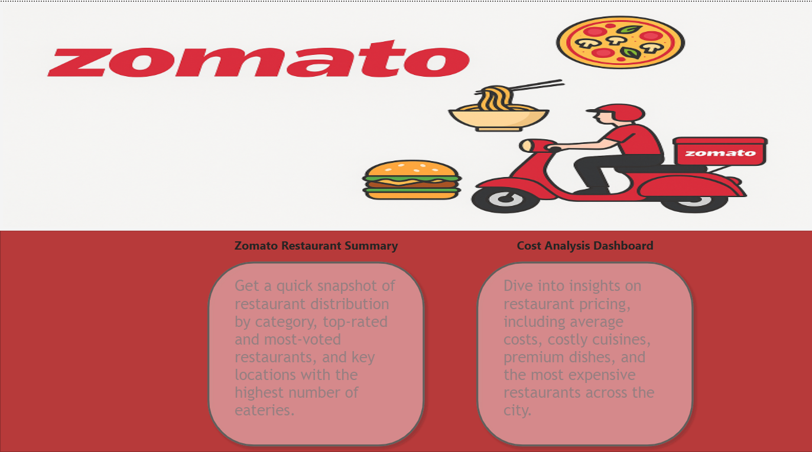
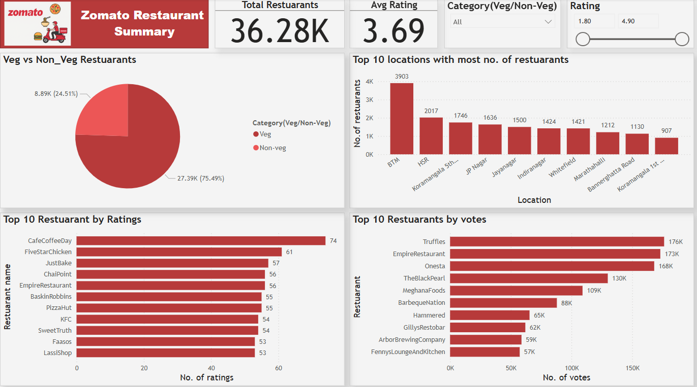
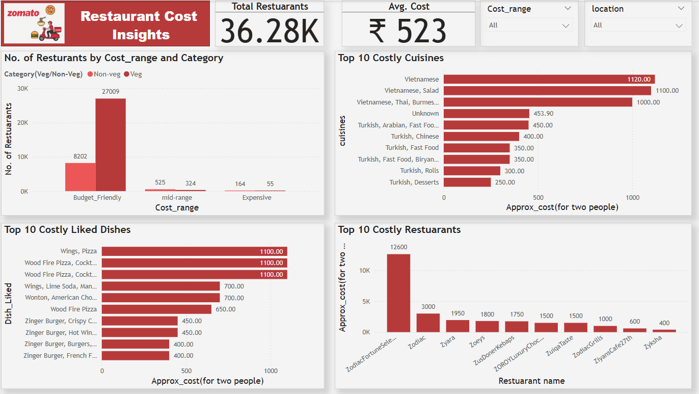

# 🍽️ Zomato Restaurant(Bengaluru) Data Analysis with Power BI

[Live Project](https://app.powerbi.com/links/g-FgthDz8M?ctid=950737a4-2947-46ce-9c53-4728f01fd598&pbi_source=linkShare) <!-- Replace with your project banner image if available -->

This project presents an end-to-end data analysis of Zomato restaurant data using **Python for data cleaning** and **Power BI for visualization**. It uncovers key patterns in restaurant pricing, customer preferences, ratings, and locations — offering actionable insights for strategic decision-making in the food and restaurant industry.

---

## 🧼 Data Preparation

- Cleaned and preprocessed raw data using **Python (Pandas & NumPy)**.
- Handled missing values, duplicates, inconsistent formatting, and data type conversions.
- Exported the cleaned dataset to CSV format for seamless integration into Power BI.

---

## 📊 Dashboard Overview

### 🔹 **Page 1: Ratings & Location Insights**
- ⭐ **Top Rated Restaurants**
- 🗳️ **Most Voted Restaurants**
- 📍 **Top 10 Restaurant-Dense Locations** (e.g., BTM, HSR Layout)
- 🔄 **Veg vs Non-Veg Distribution**

  
### 🔹 **Page 2: Cost & Cuisine Insights**
- 📌 **Total Restaurants Analyzed**: 36,280
- 💸 **Average Cost for Two**: ₹523
- 🥗 **Category Breakdown**: Veg vs. Non-Veg
- 🍽️ **Top 10 Costly Cuisines** (e.g., Vietnamese, Thai)
- 🍕 **Top 10 Expensive Liked Dishes**
- 🏆 **Top 10 Costliest Restaurants**
- 📉 **Restaurant Count by Cost Range and Category**

---

## 🧠 Key Insights & Recommended Actions

### ✅ Insight 1: Most restaurants fall into the low-to-mid cost range  
**Action**: Focus on affordability and volume-based models for competitive positioning.

### ✅ Insight 2: Vietnamese and Thai cuisines are the most expensive  
**Action**: Target niche premium markets for these cuisines in upscale areas.

### ✅ Insight 3: BTM and HSR Layout have the highest restaurant density  
**Action**: Ideal zones for food delivery, cloud kitchens, and new store launches.

### ✅ Insight 4: Restaurants like Truffles and EmpireRestaurant are highly rated and voted  
**Action**: Benchmark their success factors—menu design, pricing, service—to replicate performance.

### ✅ Insight 5: Non-Veg restaurants dominate  
**Action**: An opportunity exists to differentiate with high-quality, themed Veg-only restaurants.

---

## 📂 Dataset Features
- **Cost** (for two people)
- **Category** (Veg/Non-Veg)
- **Cuisines**
- **Dish Liked**
- **Location**
- **Ratings & Votes**

---

## ⚙️ Tools & Techniques
- **Python** for data cleaning and preprocessing
- **Power BI Desktop** for data modeling and visualization
- **Power Query** for lightweight transformations
- **DAX Measures** for custom KPIs
- **Interactive Filters & Custom Visuals**

---

## 📷 Dashboard Screenshots
### Home Page

### Page 1:  Ratings & Location Analysis  

### Page 2: Cost & Cuisine Analysis   

---

## 📌 Project Outcome
This project demonstrates my skills in:
- End-to-end data pipeline (cleaning → analysis → visualization)
- Python data wrangling
- Power BI dashboarding
- Extracting business insights and recommending data-driven actions

---

## 👨‍💼 About Me
**Neeraj Vepula**  
Data Analyst | Power BI Certified | Python Enthusiast | Business Insight Strategist  
🔗 [LinkedIn](https://www.linkedin.com/in/neeraj-velpula/) | 📧 [neerajvelpula2001@gmail.com](neerajvelpula2001@gmail.com)

---
